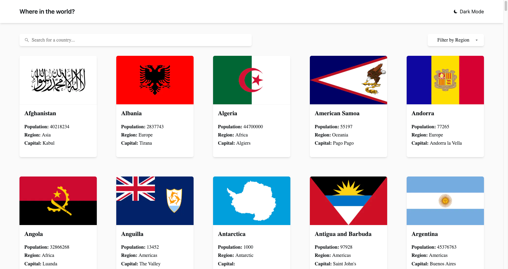
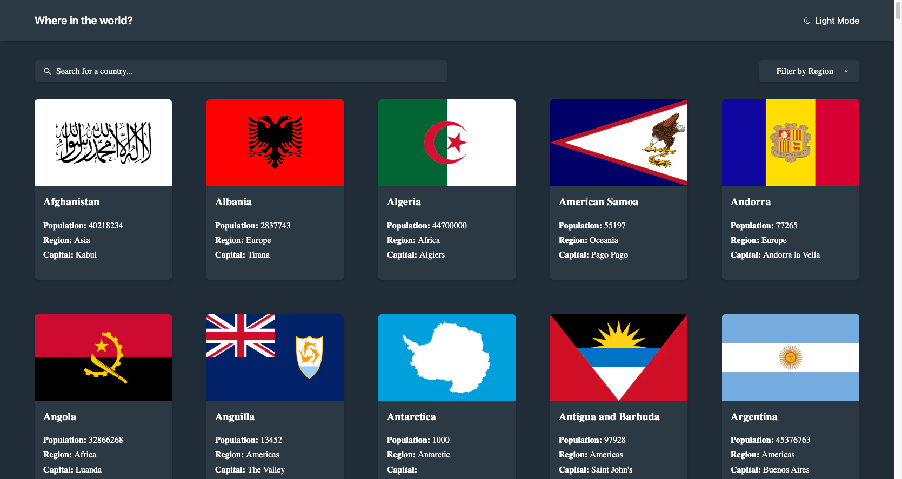

# Frontend Mentor - Tip calculator app solution

This is a solution to the [REST Countries API with color theme switcher challenge on Frontend Mentor](https://www.frontendmentor.io/challenges/rest-countries-api-with-color-theme-switcher-5cacc469fec04111f7b848ca).

## Table of contents

- [Overview](#overview)
  - [The challenge](#the-challenge)
  - [Screenshot](#screenshot)
  - [Links](#links)
  - [Built with](#built-with)
- [Author](#author)

## Overview

### The challenge

Users should be able to:

- See all countries from the API on the homepage
- Search for a country using an `input` field
- Filter countries by region
- Click on a country to see more detailed information on a separate page
- Click through to the border countries on the detail page
- Toggle the color scheme between light and dark mode *(optional)*

### Screenshot

### Links

[Live website](https://countries-api-bice-six.vercel.app/)

### Built with

- [TailwindCSS](https://tailwindcss.com/)
- [React](https://reactjs.org/)
- [Next.js](https://nextjs.org/)
- TypeScript

## Author

- Frontend Mentor - [@yehoki](https://www.frontendmentor.io/profile/yehoki)
- [Github](https://www.github.com/yehoki)
