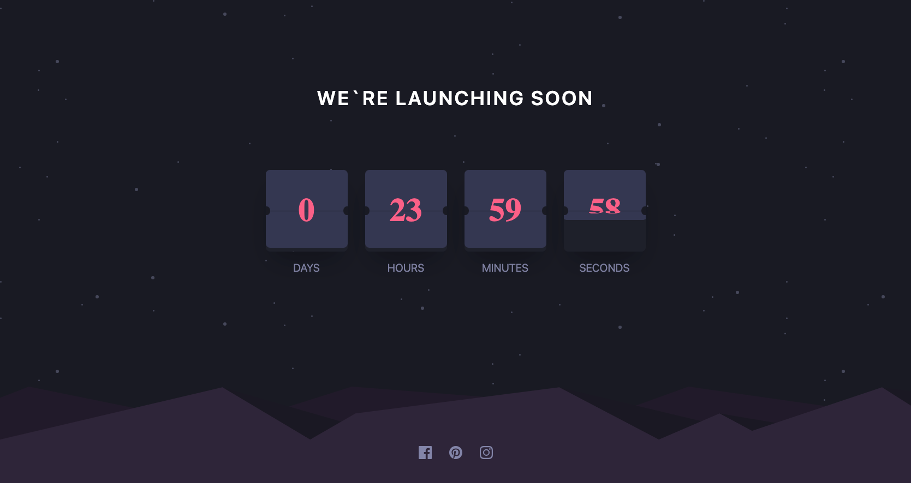

# Frontend Mentor - Tip calculator app solution

This is a solution to the [Launch countdown timer challenge on Frontend Mentor](https://www.frontendmentor.io/challenges/launch-countdown-timer-N0XkGfyz-).

## Table of contents

- [Overview](#overview)
  - [The challenge](#the-challenge)
  - [Screenshot](#screenshot)
  - [Links](#links)
  - [Built with](#built-with)
- [Author](#author)

## Overview

### The challenge

Users should be able to:

- See hover states for all interactive elements on the page
- See a live countdown timer that ticks down every second (start the count at 14 days)
- **Bonus**: When a number changes, make the card flip from the middle

### Screenshot

### Links

[Live website](https://launch-countdown-flame.vercel.app/)

### Built with

- [TailwindCSS](https://tailwindcss.com/)
- [React](https://reactjs.org/)
- [Next.js](https://nextjs.org/)
- TypeScript

## Author
- Frontend Mentor - [@yehoki](https://www.frontendmentor.io/profile/yehoki)
- [Github](https://www.github.com/yehoki)