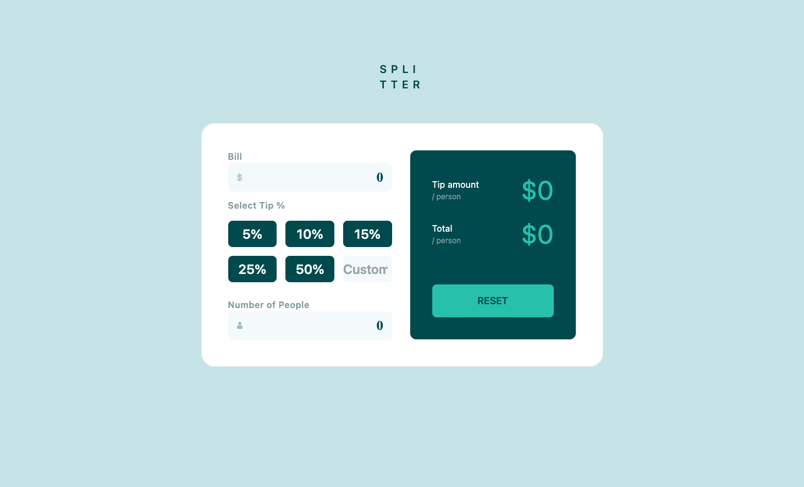

# Frontend Mentor - Tip calculator app solution

This is a solution to the [Tip calculator app challenge on Frontend Mentor](https://www.frontendmentor.io/challenges/tip-calculator-app-ugJNGbJUX).

## Table of contents

- [Overview](#overview)
  - [The challenge](#the-challenge)
  - [Screenshot](#screenshot)
  - [Links](#links)
  - [Built with](#built-with)
- [Author](#author)

## Overview

### The challenge

Users should be able to:

- View the optimal layout for the app depending on their device's screen size
- See hover states for all interactive elements on the page
- Calculate the correct tip and total cost of the bill per person

### Screenshot

### Links

[Live website](https://tip-calculator-phi-henna.vercel.app/)

### Built with

- [TailwindCSS](https://tailwindcss.com/)
- [React](https://reactjs.org/)
- [Next.js](https://nextjs.org/)
- TypeScript

## Author
- Frontend Mentor - [@yehoki](https://www.frontendmentor.io/profile/yehoki)
- [Github](https://www.github.com/yehoki)